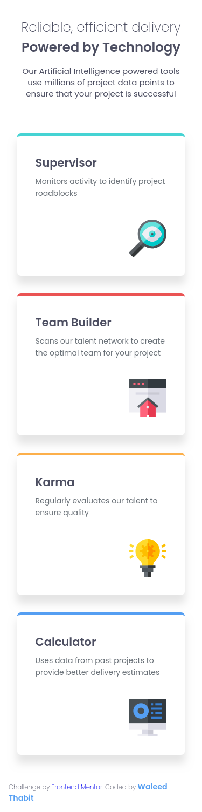
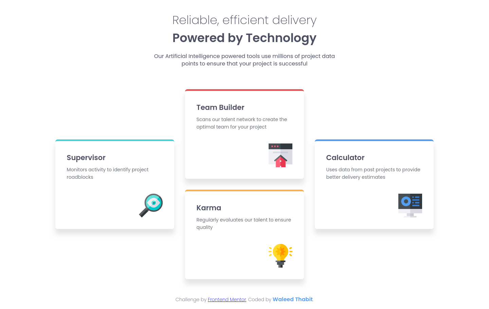

# Frontend Mentor - Four card feature section solution

This is a solution to the [Four card feature section challenge on Frontend Mentor](https://www.frontendmentor.io/challenges/four-card-feature-section-weK1eFYK). Frontend Mentor challenges help you improve your coding skills by building realistic projects.

## Table of contents

- [Overview](#overview)
  - [The challenge](#the-challenge)
  - [Screenshot](#screenshot)
  - [Links](#links)
- [My process](#my-process)
  - [Built with](#built-with)
  - [What I learned](#what-i-learned)
  - [AI Collaboration](#ai-collaboration)
- [Author](#author)

## Overview

### The challenge

Users should be able to:

- View the optimal layout for the site depending on their device's screen size

### Screenshot

Mobile:



Desktop:



### Links

- Solution URL: [https://github.com/waleed-thabit/four-card-feature](https://github.com/waleed-thabit/four-card-feature)
- Live Site URL: [https://waleed-thabit.github.io/four-card-feature/](https://waleed-thabit.github.io/four-card-feature/)

## My process

### Built with

- Semantic HTML5 markup
- CSS custom properties
- Flexbox
- CSS Grid
- Mobile-first workflow
- Vanilla HTML and CSS only, no frameworks

### What I learned

I didn't learn anything new in this project, it was mostly reinforcing concepts I already knew.

I placed the four cards on a grid with 3 columns (`1fr` each) and 4 rows total. The middle column holds two stacked cards (each spanning 2 rows), while the two side cards each span 2 rows as well but are offset by one row, which centers them vertically between the two middle cards.

```css
.card-1 {
  grid-column: 1/2;
  grid-row: 2/4;
}
.card-2 {
  grid-column: 2/3;
  grid-row: 1/3;
}
.card-3 {
  grid-column: 2/3;
  grid-row: 3/5;
}
.card-4 {
  grid-column: 3/4;
  grid-row: 2/4;
}
```

### AI Collaboration

I did not use AI to build this project. I used **Claude** only to help me write this README.

## Author

- GitHub - [@waleed-thabit](https://github.com/waleed-thabit)
- Frontend Mentor - [@waleed-thabit](https://www.frontendmentor.io/profile/waleed-thabit)
